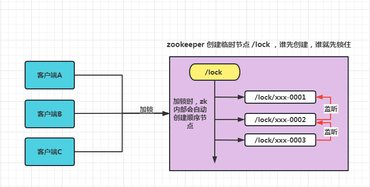

# Spring Boot 集成 Zookeeper 分布式锁

## 简介

本项目会演示 Zookeeper 分布式锁的使用，会以常见的 “超卖”业务去演示
> 本示例代码主要包括两部分
> 1. curator 实现的分布式锁使用演示
> 2. 自己实现的 Zookeeper 分布式锁使用演示
> 

> ps: 我这里部署集群使用的是 docker-compose ，配置文件在这里[docker-compose-zookeeper-cluster3.yml](_doc/docker-compose-zookeeper-cluster3.yml)

## zk 实现分布式锁的原理

> Zookeeper节点路径不能重复 保证唯一性。 临时节点+事件通知
>
> Zookeeper 实现分布式锁具有天然的优势，临时顺序节点，可以有效的避免死锁问题，让客户端断开，那么就会删除当前临时节点，让下一个节点进行工作。

1. 所有请求进来，在 /lock 下创建 临时顺序节点 ，放心，Zookeeper 会帮你编号排序
2. 判断自己是不是 /lock 下最小的节点
    1. 是，获得锁（创建节点）
    2. 否，对前面小我一级的节点进行监听
3. 获得锁请求，处理完业务逻辑，释放锁（删除节点），后一个节点得到通知（比你年轻的死了，你成为最嫩的了）
4. 重复步骤2

Zookeeper 内部加锁示意图



整体业务加zk分布式锁流程图

## 版本依赖

|技术栈|版本|
| ---------------- | -------------------------- |
|Spring Boot | 2.7.0 |
|MySQL | 5.7 |
|Zookeeper | 3.7 |
|Maven|3.8.3|

## 集成步骤
> ps:
> 这里实现了两种 zk 锁
> 1. 一种是基于 curator 实现的 zk 锁 [CuratorZookeeperLock](src/main/java/top/bulk/lock/zk/lock/CuratorZookeeperLock.java)
> 2. 一种是自己实现的 zk 锁 [BulkZookeeperLock](src/main/java/top/bulk/lock/zk/lock/BulkZookeeperLock.java)
     这里使用 curator-recipes 来进行 zk 的相关操作
> 
### 1. 首先引入相关依赖


```xml
<!-- zk 分布式锁支持 -->
<dependency>
    <groupId>org.apache.curator</groupId>
    <artifactId>curator-recipes</artifactId>
    <version>5.1.0</version>
</dependency>
        <!-- 数据库支持-->
<dependency>
<groupId>mysql</groupId>
<artifactId>mysql-connector-java</artifactId>
<version>8.0.27</version>
</dependency>
<dependency>
<groupId>com.baomidou</groupId>
<artifactId>mybatis-plus-boot-starter</artifactId>
<version>3.5.2</version>
</dependency>

```

### 2. 配置 zk

向容器中注入 CuratorFramework 对象

```java
@Configuration
@Data
public class CuratorZookeeperLockConfig {
   @Resource
   private ZookeeperProperty zookeeperProperty;

   /**
    * 链接 zk
    * 向容器中注入  CuratorFramework 方便后面使用
    *
    * @return curatorFramework
    */
   @Bean(initMethod = "start", destroyMethod = "close")
   public CuratorFramework curatorFramework() {
      //  重试策略 （1000毫秒试1次，最多试3次）
      RetryPolicy retryPolicy = new ExponentialBackoffRetry(zookeeperProperty.getBaseSleepTimeMs(), zookeeperProperty.getMaxRetries());

      return CuratorFrameworkFactory.builder()
              .connectString(zookeeperProperty.getZkServers())
              .sessionTimeoutMs(zookeeperProperty.getSessionTimeout())
              .connectionTimeoutMs(zookeeperProperty.getConnectionTimeout())
              .retryPolicy(retryPolicy)
              .build();
   }
}
```

### 3. Curator zk 锁逻辑代码

逻辑代码中包含，加锁和解锁两个方法

```java

@Slf4j
@RequiredArgsConstructor
@Component
public class ZookeeperLock {
    private final CuratorFramework curatorFramework;

    /**
     * 加锁
     *
     * @param lockKey 锁标识
     * @return 锁信息
     */
    public InterProcessMutex lock(String lockKey) {
        if (!CuratorFrameworkState.STARTED.equals(curatorFramework.getState())) {
            log.warn("在调用此方法之前必须启动 CuratorFramework 实例");
            return null;
        }
        String nodePath = "/curator/lock/%s";
        try {
            // 可重入锁：InterProcessMutex 不可重入锁：InterProcessSemaphoreMutex
            InterProcessMutex mutex = new InterProcessMutex(curatorFramework, String.format(nodePath, lockKey));
            final boolean locked = mutex.acquire(-1L, null);
            return locked ? mutex : null;
        } catch (Exception e) {
            return null;
        }
    }

    /**
     * 解锁
     *
     * @param lockInstance 锁实例
     */
    public void unLock(InterProcessMutex lockInstance) {
        try {
            lockInstance.release();
        } catch (Exception e) {
            log.warn("zookeeper lock release error", e);
        }
    }
}
```
### 3. 自己实现 zk 锁逻辑代码
```java
public class BulkZookeeperLock {

    private ZooKeeper zk = null;
    /**
     * zookeeper 连接
     */
    private final CountDownLatch connectLatch = new CountDownLatch(1);

    /**
     * zookeeper节点等待
     */
    private final CountDownLatch waitLatch = new CountDownLatch(1);

    /**
     * 操作的当前节点
     */
    private String currentNode = null;
    /**
     * 当前节点要监视的上一个节点
     */
    private String waitPath = null;

    public BulkZookeeperLock(ZookeeperProperty property) throws IOException, InterruptedException, KeeperException {

        //建立和zookeeper集群的连接
        zk = new ZooKeeper(property.getZkServers(), property.getSessionTimeout(), new Watcher() {
            @Override
            public void process(WatchedEvent watchedEvent) {
                // 连接建立时, 打开latch, 唤醒 wait 在该 latch 上的线程
                if (watchedEvent.getState() == Event.KeeperState.SyncConnected) {
                    connectLatch.countDown();
                }

                // 发生了 waitPath 的删除事件 唤醒 waitLatch
                if (watchedEvent.getType() == Event.EventType.NodeDeleted && watchedEvent.getPath().equals(waitPath)) {
                    waitLatch.countDown();
                }
            }
        });

        //等待建立连接，即连接建立之后才会执行之后的代码。
        connectLatch.await();

        //判断根节点"/locks"是否存在
        Stat stat = zk.exists("/locks", false);
        if (stat == null) {
            //根节点 “/locks” 不存在，创建根节点
            zk.create("/locks", "lock".getBytes(), ZooDefs.Ids.OPEN_ACL_UNSAFE, CreateMode.PERSISTENT);
        }
    }

    /**
     * 加锁方法，加锁就是在根节点“/locks”，下创建节点，不过要判断是否能获取锁。
     * 若当前节点是最小的，则可以获取锁，否则应该监听它前一个节点
     */
    public void lock() {
        try {
            currentNode = zk.create("/locks/seq-", null, ZooDefs.Ids.OPEN_ACL_UNSAFE, CreateMode.EPHEMERAL_SEQUENTIAL);

            Thread.sleep(10);

            // 注意, 没有必要监听"/locks"的子节点的变化情况
            List<String> children = zk.getChildren("/locks", false);

            if (children.size() == 1) {
                // 列表中只有一个子节点, 那肯定就是 currentNode , 说明client 获得锁
                return;
            } else {
                //对根节点下的所有临时顺序节点进行从小到大排序
                Collections.sort(children);

                //获取当前节点名称，如 seq-0000001
                String thisNode = currentNode.substring("/locks/".length());

                //获取当前节点在children中的位置
                int index = children.indexOf(thisNode);

                if (index == -1) {
                    System.out.println("数据异常");
                } else if (index == 0) {
                    // index为0表示，thisNode 在列表的子节点中最小，可以获取到锁
                    return;
                } else {
                    // 否则监听当前节点的上一个节点
                    waitPath = "/locks/" + children.get(index - 1);
                    // 在 waitPath 上注册监听器, 当 waitPath 被删除时,zookeeper 会回调监听器的 process 方法
                    zk.getData(waitPath, true, new Stat());
                    // 进入等待锁状态，如果说，上一个节点他进行了解锁，那么就可以由上面的 waitLatch.countDown(); 唤醒 继续执行，即加锁成功
                    waitLatch.await();
                    return;
                }
            }

        } catch (KeeperException | InterruptedException e) {
            e.printStackTrace();
        }

    }

    /**
     * 解锁方法，解锁就是删除当前节点
     */
    public void unLock() {
        try {
            zk.delete(currentNode, -1);
        } catch (InterruptedException | KeeperException e) {
            e.printStackTrace();
        }
    }
}
```
### 5. 使用锁

详细的业务代码，在类 [ProductStockServiceImpl](src/main/java/top/bulk/lock/zk/service/impl/ProductStockServiceImpl.java) 中

```java
@Service("productStockService")
public class ProductStockServiceImpl extends ServiceImpl<ProductStockMapper, ProductStock> implements ProductStockService {
   @Resource
   ProductStockMapper productStockMapper;
   @Resource
   CuratorZookeeperLock zookeeperLock;
   @Resource
   ZookeeperProperty zookeeperProperty;

   @Override
   public String reduceStock(Integer id) {
      // 加 zk 锁
      InterProcessMutex mutex = zookeeperLock.lock("stock");
      try {
         ProductStock stock = productStockMapper.selectById(id);
         if (stock != null && stock.getStock() > 0) {
            productStockMapper.reduceStock(id);
         } else {
            throw new RuntimeException("库存不足！");
         }
      } finally {
         // 解 zk 锁
         zookeeperLock.unLock(mutex);
      }
      return "ok";
   }

   @SneakyThrows
   @Override
   public String reduceStockByMyLock(Integer id) {
      // 加 zk 锁
      BulkZookeeperLock zkLock = new BulkZookeeperLock(zookeeperProperty);
      try {
         zkLock.lock();
         ProductStock stock = productStockMapper.selectById(id);
         if (stock != null && stock.getStock() > 0) {
            productStockMapper.reduceStock(id);
         } else {
            throw new RuntimeException("库存不足！");
         }
      } finally {
         // 解 zk 锁
         zkLock.unLock();
      }
      return "ok";
   }
}
```

## 启动说明

1. 如果是 Docker 做的 zk 集群；需要在启动项目的电脑本地 hosts 中配置zk host name的集群映射关系，不然会出现空指针异常
2. 更改数据库链接配置，导入数据库 [sql](_db/lock-test.sql)
3. 点击启动类 [SpringBootLockZookeeperApplication](src/main/java/top/bulk/lock/zk/SpringBootLockZookeeperApplication.java)
   启动项目
4. 访问接口 `http://localhost:8080/reduceStock/1` , 即可测试锁接口，ProductStockController 类中有多个接口，可以分别测试效果

## 测试说明

1. 压测工具使用 JMeter , 当然也可以用别的，我用的这个
2. 本地测试，借助于 IDEA 的 `Allow parallel run` 功能启动多个相同的服务（模拟线上环境多个副本），注意修改端口（-Dserver.port=8089），操作可以看下图
3. 使用 Nginx 工具，将启动的多个项目做负载均衡；负载均衡配置文件可以参考 [zk-load-balance.conf](_doc/zk-load-balance.conf)
4. 接下来就是使用 JMeter 开启多个线程去压测 Nginx 暴露出来的接口了

